# Equiterra

A full-stack web application built for a real client: my brother, a Farrier (equine hoof
care practitioner) who specializes in show jumping horses. The system manages client
records, invoices, and horse records including photos, veterinary records, and shoeing protocols.

Originally developed as a team project, this repository is my maintained and containerized
version with additional improvements.

Built with PHP, HTML/CSS, and MySQL on Apache with Docker.

<br>

## How to Run the System

### Prerequisites
- Docker

### Clone the repository
```bash
git clone https://github.com/your-username/equiterra.git
```

### Navigate to the root directory
```bash
cd equiterra
```

### Build and run the service
```bash
docker compose up -d
```

- On first run, Docker builds the images locally, spins up MySQL, 
and injects the full database schema and demonstration seed data automatically.

### Access the service as either an Admin or Client

-   [Open the portal in a browser](http://localhost:8080) and login with either user role

    | Role | Username | Password | Privileges |
    |---|---|---|---|
    | **Admin (Farrier)** | `admin` | `open sesame` | Full CRUD Access — add and edit all records, manage invoices, view all horses and clients |
    | **Client** | `rdunmore` | `demo1234` | Identity-Based Read Access — can view only their own horses, shoeing protocols, analysis records, and invoices |

<br>

## Screenshots
### Login
<div align="center">
  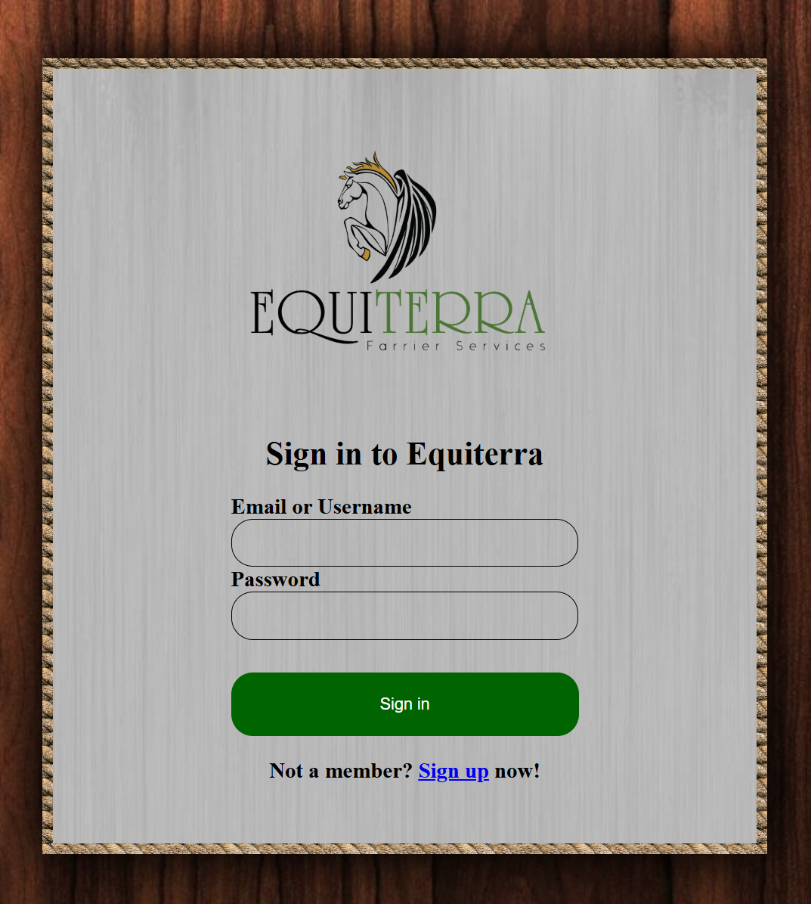
</div>

### Admin Dashboard
<div align="center">
  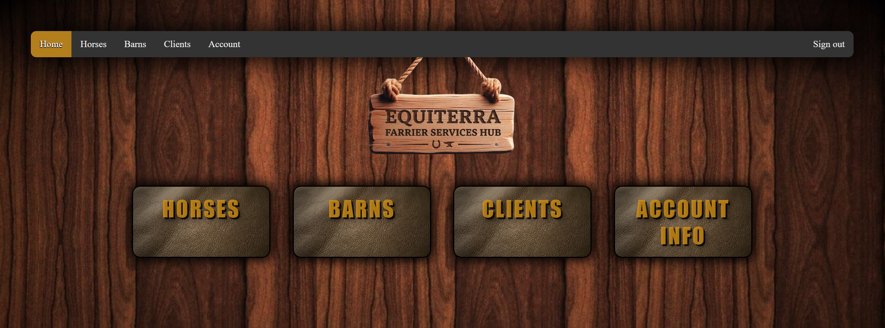
</div>

### Horse List
<div align="center">
  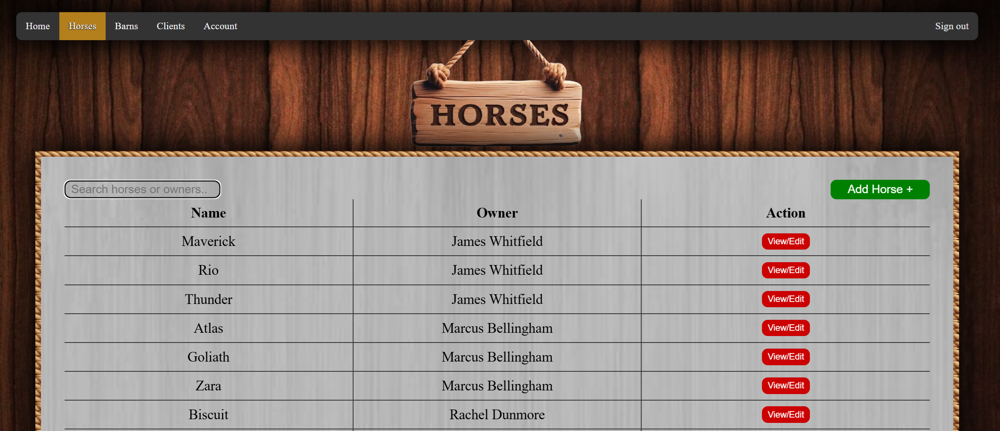
</div>

### Horse Details
<div align="center">
  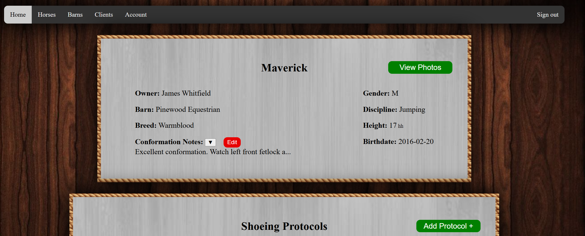
</div>

### Horse Details - Shoeing Protocols
<div align="center">
  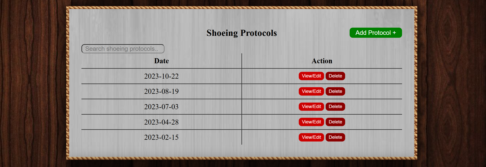
</div>

### Horse Details - Analysis & Medical Records
<div align="center">
  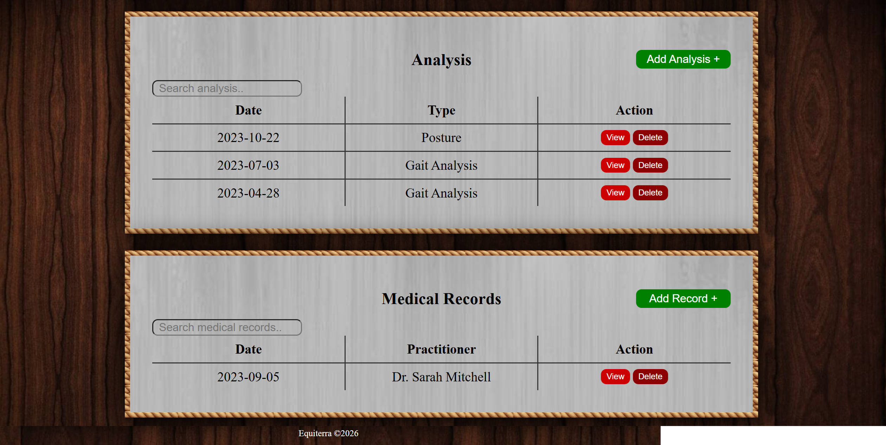
</div>

### Shoeing Protocol
<div align="center">
  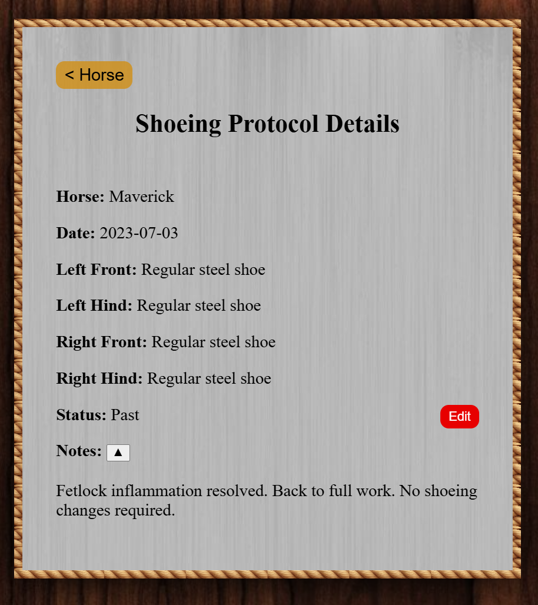
</div>

### Analysis
<div align="center">
  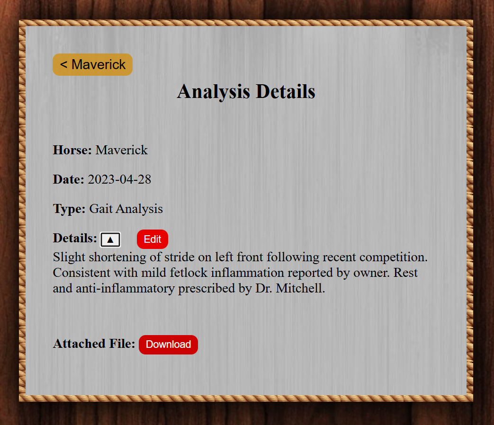
</div>

### Add Analysis
<div align="center">
  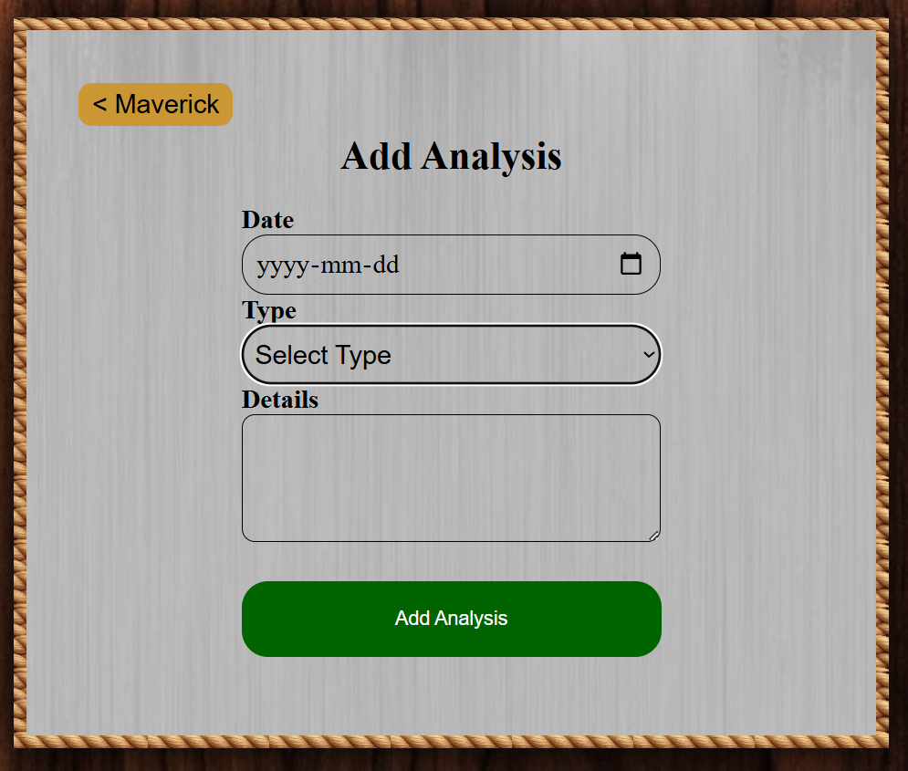
</div>

### Medical Record
<div align="center">
  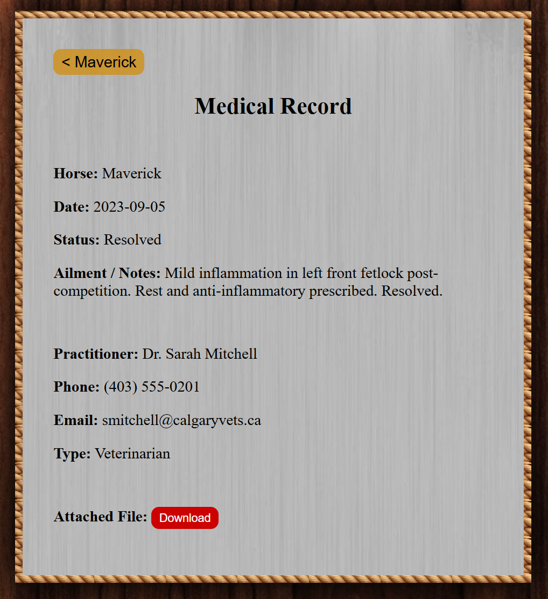
</div>

### Add Medical Record
<div align="center">
  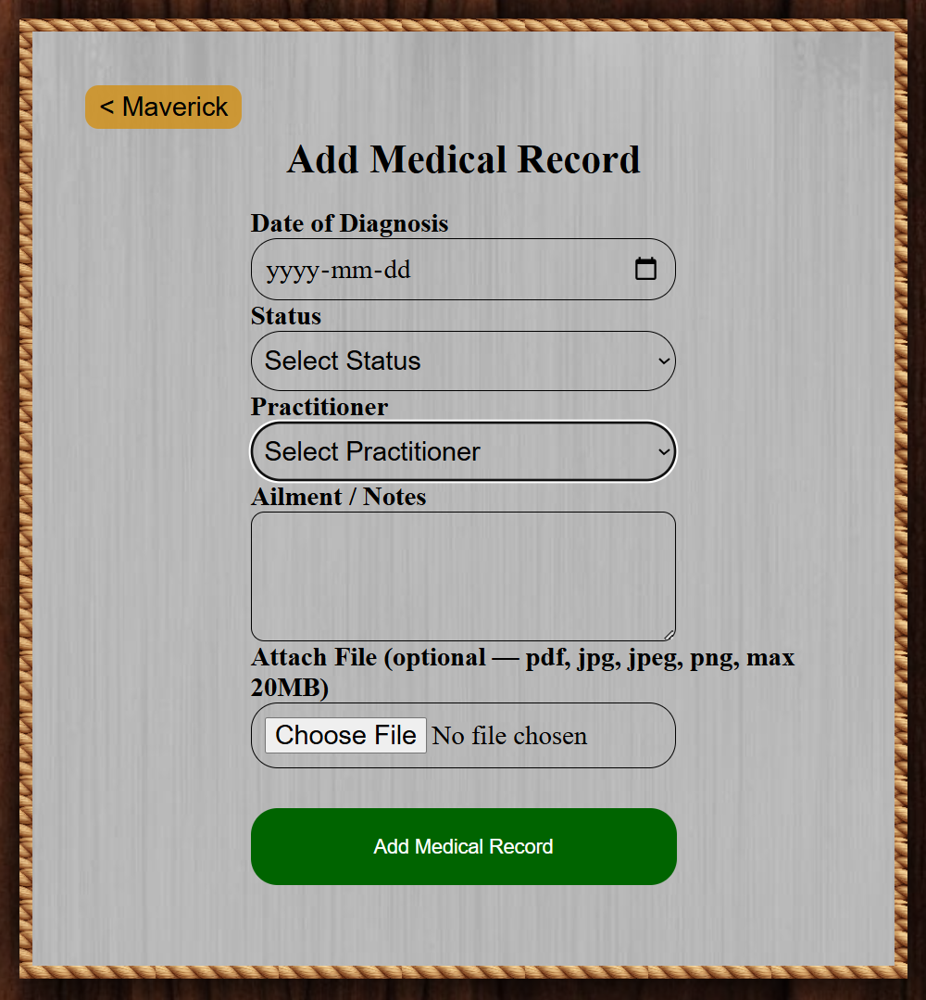
</div>

### Image Gallery
<div align="center">
  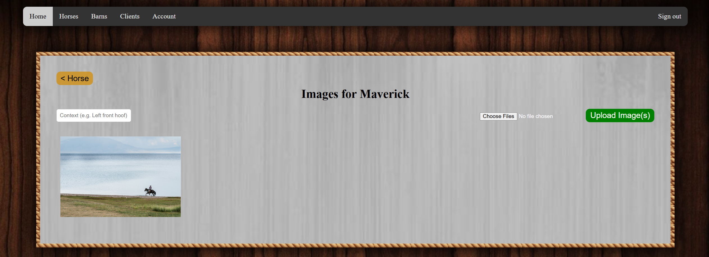
</div>

### Client List
<div align="center">
  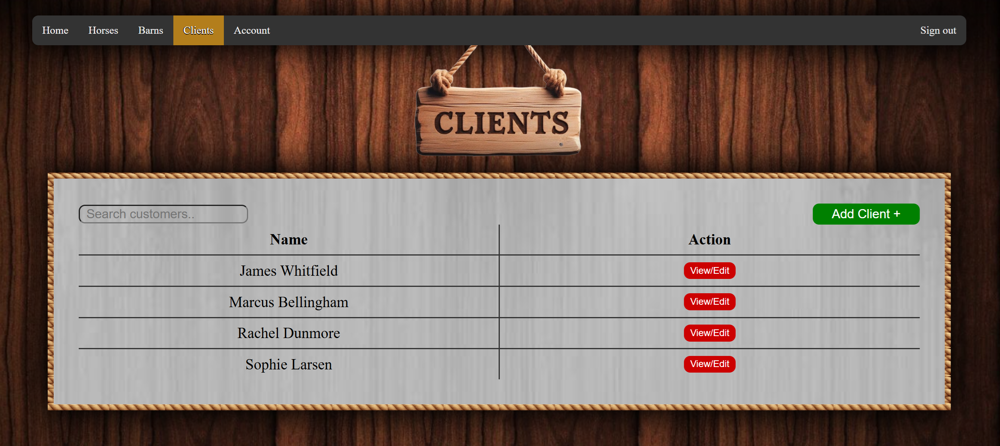
</div>

### Client Detail & Invoices
<div align="center">
  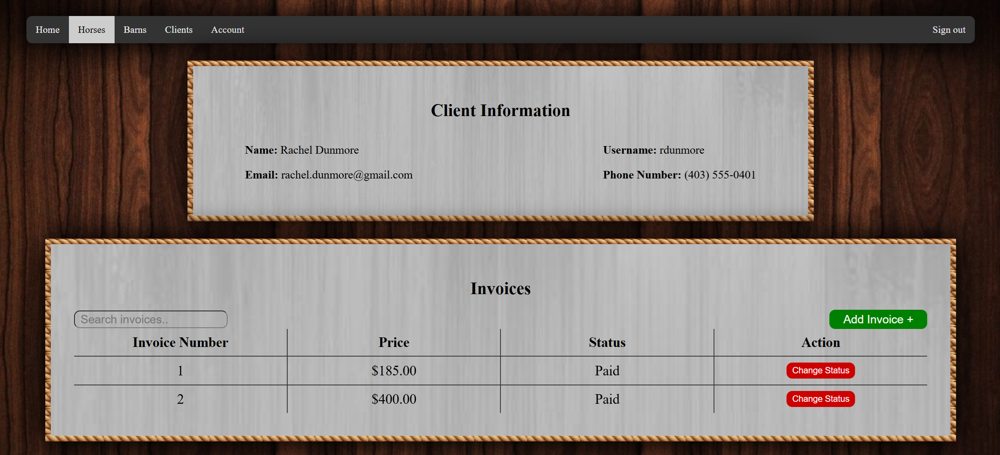
</div>

### Add Invoice
<div align="center">
  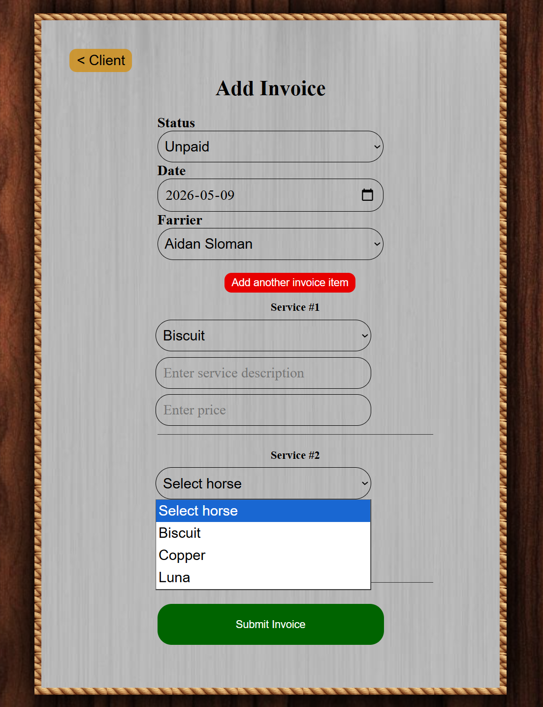
</div>

### Barn List
<div align="center">
  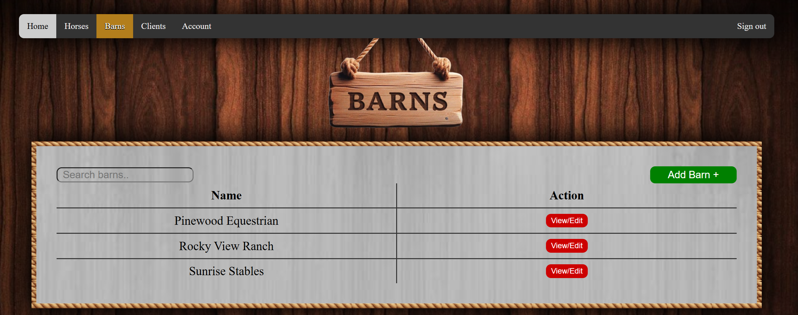
</div>

### Barn Detail
<div align="center">
  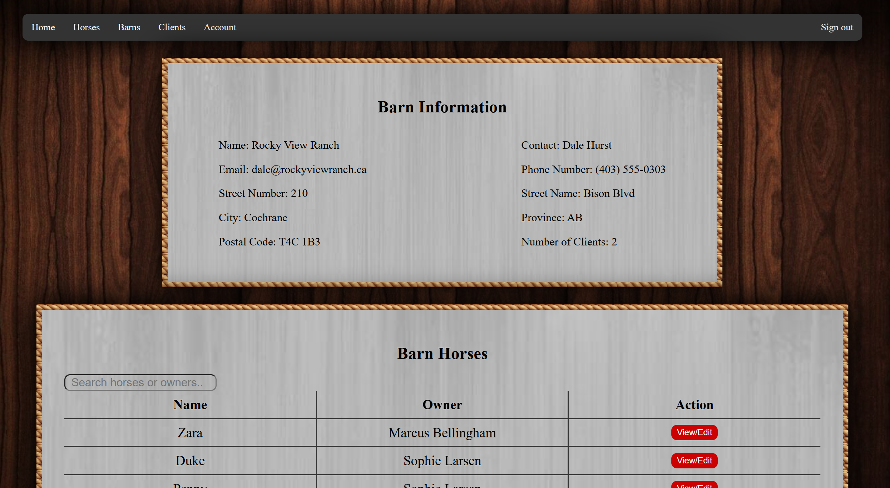
</div>

<br>

## Background

This project originated as a three-person university group project for CPSC 471
(Database Management Systems) at the University of Calgary.

My core responsibilities were:

- Gathering requirements directly from the client (my brother) and translating them into
  use cases that drove the system design
- Iterative refinements of system features based on client feedback throughout the project
- Designing the database schema and refining it through normalization (1NF, 2NF, 3NF)
  and functional dependency analysis
- Building the Enhanced Entity-Relationship Diagram (EERD) and the Relational Model (RM)
  diagram from which the schema was derived
- All SQL — table definitions, triggers, stored procedures, and views
- All PHP related to database interaction: retrieval, insertion, update, and session
  management across every page

### Original Contributions

- Aidan Sloman — Backend development, database design, SQL, and client-driven system design  
- Omar Ragab — Frontend development (HTML/CSS layout and styling)  
- Youssef Samaan — Project documentation and reports 

### New Contributions

Recently I revived and containerized the project using Docker for two reasons:
it makes the project simple to run and demonstrate locally, and it makes real-world
deployment straightforward — Docker images can be pushed directly to AWS ECR and
deployed via ECS without any environment-specific configuration. As part of this process,
the entire database was reconstructed from the original SQL documents — including all
tables, stored procedures, triggers, and views — and packaged as an initialization script
that runs automatically on first deployment. Coming back to this project after some time away, 
I took the opportunity to refine the schema — tightening primary key definitions, standardizing 
file storage, and improving naming consistency across tables.

The following improvements were made to the original system during this revival:

- **Invoices now support line items** — each service performed has its own description and
  price, and the invoice total is calculated dynamically. Previously a single price field
  lived on the invoice itself. This change was made to better reflect the typical use case —
  a farrier commonly performs several services on multiple horses in a single visit to a client or barn.

- **Images are now stored locally** — uploaded files are saved to a structured directory
  (`uploads/images/horses_by_name/<horse>/`) and the file path is stored in the database 
  (NOTE: analysis and medical files are stored in the same manner).
  Previously images were stored as external URLs, which neccesitated a separate hosting service.

- **Medical records** — a full medical record system was added, allowing clients and admins
  to log veterinary visits, ailments, and attach/download any supporting documents. Each record is 
  linked to an attending practitioner whose contact details are stored and displayed.

- **Analysis records** — hoof analysis files (radiographs, gait analysis, posture, Equigate)
  can now be uploaded and downloaded directly from the detailed analysis page.

- **Delete functionality** — admins can now delete shoeing protocols, analysis records, and
  medical records. Any files associated with the record are removed from disk alongside the 
  database record.

- **Seed data and demo files** — a set of demo data is injected automatically
  on first run, including clients, horses, images, barns, invoices, shoeing protocols, 
  in addition to analysis and medical records accompanied by sample files for each. 
  The Docker entrypoint script populates all upload directories automatically so the 
  system capabilities can be experienced right out of the box.


<br>

## Tech Stack

- **Backend:** PHP 8.1
- **Database:** MySQL 8.0
- **Web Server:** Apache (via the official `php:8.1-apache` Docker image)
- **Frontend:** HTML, CSS, JavaScript (no framework)
- **Containerization:** Docker


<br>

## Database Design

### Enhanced Entity-Relationship Diagram (EERD)
<div align="center">
  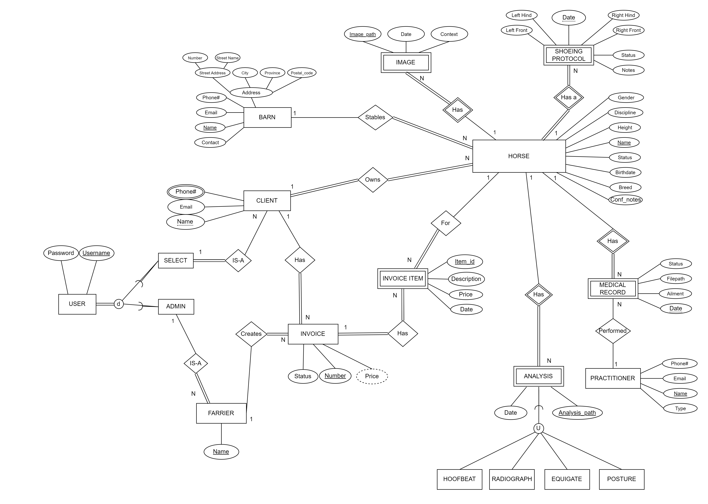
</div>

### Relational Model (RM)
<div align="center">
  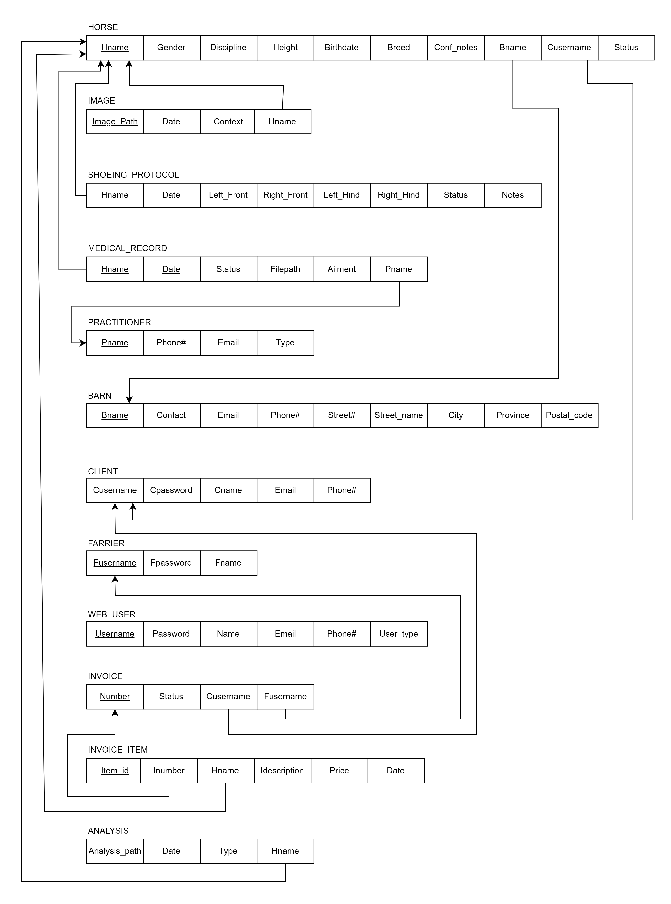
</div>

<br>


## Database Overview

### Tables

| Table | Description |
|---|---|
| `Web_user` | Unified authentication table for all users. `User_type` is either `Admin` or `Client`. Admin was chosen over Farrier since not all admins are farriers, but all farriers in this system are admins. |
| `Farrier` | Farrier business identity, linked to `Web_user` by username |
| `Client` | Client records linked to their horses and invoices |
| `Horse` | Horse records linked to a client (owner) and barn |
| `Barn` | Barn records with full address and contact information |
| `Shoeing_Protocol` | Per-horse shoeing records. Only one protocol is active (`Status=1`) at a time — adding a new protocol automatically archives all previous ones via a stored procedure |
| `Analysis` | Per-horse analysis files (Equigate, Radiograph, Posture) with editable details |
| `Image` | File paths for uploaded horse images, organized by horse |
| `Invoice` | Invoices linked to a client and farrier with paid/unpaid status |
| `Invoice_Item` | Individual line items within an invoice, each with their own description and price |
| `Medical_Record` | Veterinary and practitioner records for a horse |
| `Practitioner` | Veterinarians and other practitioners referenced in medical records |

### Triggers
Two `BEFORE INSERT` triggers on `Client` auto-generate a username (first initial + surname) and a random 
14-character password on insert. This keeps usernames consistent and allows client records to be created 
ahead of sign-up, which is necessary to maintain referential integrity when horses and invoices are added 
before a client has registered. Client usernames are immutable, but their passwords are not.

### Stored Procedures
Procedures cover authentication, horse and barn management, shoeing protocols, hoof analysis, medical records, and invoicing.
Two admin reporting views — `Num_clients_by_barn` and `Num_horses_by_barn` — are also defined. 
See `01_init.sql` for full definitions.


